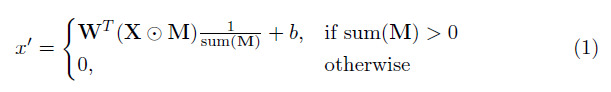
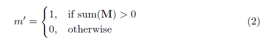
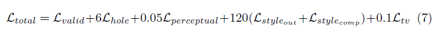

# CoMBInE
*Cosmic Microwave Inpainting Experiment*

CoMBInE is a machine learning program that trhrough inpainting aims to reconstruct patches of the Cosmic Microwave Background thermals maps, as new nowel approach to eliminate/limit the effect of the foreground.

In this program we used the innovative method developed by a group of researches from NVIDIA corporation which uses Partial convolutional layers in place of the traditional convolutional layers. Traditional CNN filter responses are conditioned on both valid pixels as well as the substitute values in the masked holes which may lead to color discrepancy and blurriness. The partial convolutions are constructed such that, given a binary mask, the results depend only on the non-hole regions at every layer. Given sufficient layers of successive updates and with the addition of the automatic mask update step, which removes any masking where the partial convolution was able to operate on an unmasked value, even the largest masked holes will eventually shrink away, leaving only valid responses in the feature map.
See paper for more details: "*Image Inpainting for Irregular Holes Using Partial Convolutions*", https://arxiv.org/abs/1804.07723. 

# Dependencies
* Python 3.6
* Keras 2.2.4
* Tensorflow 1.12

# Implementation details
Details of the implementation are in the [paper itself](https://arxiv.org/abs/1804.07723), here a short summary of the main features.

## Mask Creation
The masks we generate are of two kinds and they both used OpenCV to draw their shapes. The first method contained in the script *utils/Mask_generator.py* creates masks composed of ellipses, lines and circle of random size and position. The second method contained in the script *utils/Mask_generator_circle.py* creates circular masks with center and radius that can vary according to one's preference. For simplicity, in the analysis done so far, the circular masks were always centered at the center of the images.

## Partial Convolution Layer
The key element in this implementation is the partial convolutional layer. Basically, given the convolutional filter **W** and the corresponding bias *b*, the following partial convolution is applied instead of a normal convolution:

where ⊙ is element-wise multiplication and **M** is a binary mask of 0s and 1s. Importantly, after each partial convolution, the mask is also updated, so that if the convolution was able to condition its output on at least one valid input, then the mask is removed at that location, i.e.

After each convolution, the mask is removed at the location where convolution was able to condition its output on the valid input. The result of this is that with a sufficiently deep network, the mask will eventually disappear (be all ones).

## UNet Architecture
The architecture is UNet like, replacing all convolutional layers with partial convolutional layers and using nearest neighbor up-sampling in the decoding stage. The skip links will concatenate two feature maps and two masks respectively, acting as the feature and mask inputs for the next partial convolution layer. The last layer’s input contains the concatenation of the original input image and original mask to allow model to copy non-hole pixels (in this way the image in the non-hole pixels should basically corresponds to the original/target image). 

## Loss Function(s)
The loss function used in the paper is very convoluted and to review it, it is preferable to refer to the paper. In short it includes:

* Per-pixel losses both for maskes and un-masked regions
* Perceptual loss based on ImageNet pre-trained VGG-16 (*pool1, pool2 and pool3 layers*)
* Style loss on VGG-16 features both for predicted image and for computed image (non-hole pixel set to ground truth)
* Total variation loss for a 1-pixel dilation of the hole region

The weighting of all these loss terms are as follows:

## Training Procedure
CoMBInE was trained on 1000 simulated CMB thermal maps created with CAMB. From each map it was taken only the central area, dividing it in 10 square patches 128x128 pixel each. In total the program was thus trained on 10000 images.
The dataset was divided in Training, Validation and Test set, corresponding respectively to 70%, 15%, 15% of the total dataset. Training was furthermore performed using the Adam optimizer in two stages since batch normalization presents an issue for the masked convolutions (as mean and variance is calculated for hole pixels).

**Stage 1**
Learning rate of 0.0001 for *n1* epochs with batch normalization enabled in all layers

**Stage 2**
Learning rate of 0.00005 for *n2* epochs where batch normalization in all encoding layers is disabled.

The number of epochs *n1*; *n2* to run in each step should be determined based on the evolution of the validation loss and total loss. If they stop steadily decreasing, move on to the next step.

# How to use this repository

## Libraries
The libraries were essentialy taken from the Git repository https://github.com/MathiasGruber/PConv-Keras where Mathias Gruber tries to reproduce the results obtained in the paper "*Image Inpainting for Irregular Holes Using Partial Convolutions*". They were then modified in order to account for the needs of this research.

*Mask Generator (Random shapes)*

Generates masks made of ellipses, circles and lines in random order, amount and size to cover about 25% of the input 128x128 pixel image.

*Mask Generator 2 (Circle with various radius)*

Generates circular mask of various radius and center position that can cover from 0 to 100% of the input 128x128 pixel image. This masking is very useful to measure the ability of CoMBInE to recontruct the image based on the percentage of area covered.

*PConv UNet Architecture (512x512): utils/PConv_Unet_model.py*

This model takes in 512x512 pixel images. The coding and decoding stages of the UNet architecture are made of 8 layers. In the coding phase the number of filters in each convolution steadily increases from 64 to 512 meanwhile the kernel size decreases from 7 to 3. In the decoding stage, the kernel size is kept constant at 3 meanwhile the number of filters in each convolution decreases steadily until the final concatenation with the input image where it is equal to 3.

*PConv UNet Architecture (128x128): utils/PConv_Unet_model_100.py*

This model takes in 128x128 pixel images. It was mainly constructed for purposes of time optimization, since with 512x512 pixel images the training was very slow an it is what was used in this research. The coding and decoding stages follow the same structure in terms of filters and kernel sizes but the number of layers is reduced to 7.

## Training

**Old Dataset:** *combine_training.py*

The batch size was chosen to be 3 and each epoch was composed of 10000 steps including 1000 validation steps. In total CoMBInE was trained for 42 epochs, respectively 25 epochs for the first phase and 17 for the second phase. The learning rate was very steep during the first 20 epochs and then levelled off with the validation loss that specifically stopped to monotonically decrease. For more details see picture */images_and_plots/CMB_inpainting_percent_plot2_phase1_trainset_10000-2.jpg*

**New Dataset:** *combine_training_new.py (work in progress)*

The images are divided in 10 classes corresponding to the 10 different values of the scalar spectral index ( ***SSI***) used. All spectral indeces were chosen between 0.5 and 1.5. More specifically the values of ***SSI*** are [0.5;0.7;0.9;0.95;1;1.05;1.1;1.3;1.5]. The range is more dense around 0.95 which corresponds to the value observationally better contrained. Indeed, this choice was made in order to achieve better results for CMB maps with parameters closer to the one observationally measured (by better results we mean enhancing the ability of CoMBInE, for ***SSI*** near 0.95, to distinguish maps in regard to the ***SSI*** they belong to).
The batch size was increased to 16 and the number of steps per epoch and the validation steps were changed accordingly to that and the total new number of images in the dataset (specifically 6250 steps and 625 validation steps). The motivation for this increase in the batch size is to ensure that CoMBInE passes minimum through one image per class before updating its weights. That said the batch size is still not definite, the program has not yet finished its training so the total number of epochs is still unknowned and some of the parameters may be tuned in the meantime.

**Loading the model and chunked training process**

Recall that, given the structure of CoMBInE, there is no need to worry about determining a total number of epochs to run for the training. Indeed we can simply run it for a small number of epochs and then based on the improvement in the total and validation loss, restart the training uploading the last updated weights and follow the same procedure.

**Important note on Pre-trained weights**

The model must be always at first initialized with the VGG 16 weights from imagenet before loading the new weights obtained after the training and use them to make valid predictions.
* [Ported VGG 16 weights](https://drive.google.com/open?id=1HOzmKQFljTdKWftEP-kWD7p2paEaeHM0)

## Analysis: Target vs Prediction comparison 

**Mean and Standard Deviation Gross Difference**

**RGB and Grey scale Color Distribution**

**Final epoch image outputs**

